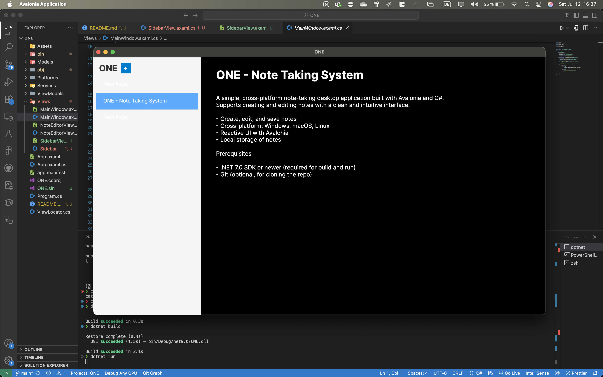

# ONE - Note Taking System

A simple, elegant cross-platform note-taking application built with Avalonia UI and C#.

---

## Features

- Create, edit, and save multiple note pages
- Clean, intuitive interface with Markdown-like text input
- Cross-platform support: macOS, Windows, Linux

---

## Screenshot



---

## Installation & Running Locally

### Prerequisites

- [.NET 9 SDK](https://dotnet.microsoft.com/en-us/download/dotnet/9.0) installed on your machine
- Git (for cloning the repo)

---

### Clone the repository

```bash
git clone https://github.com/YOUR_USERNAME/ONE.git
cd ONE


Build & Run
macOS / Linux
```bash

dotnet build
dotnet run
```

Windows (PowerShell)

```bash
dotnet build
dotnet run
```

Publish for your platform
If you want to create a self-contained executable, run:

```bash
# For Windows (64-bit)

dotnet publish -c Release -r win-x64 --self-contained true


# For macOS (64-bit)


dotnet publish -c Release -r osx-x64 --self-contained true


# For Linux (64-bit)
dotnet publish -c Release -r linux-x64 --self-contained true
```

The output will be in the bin/Release/net9.0/{runtime} folder.

## How to add a new note

Click the "+" button in the sidebar or press Cmd+N (Mac) / Ctrl+N (Windows/Linux)

Start editing your new page immediately!

## Contributing

Contributions and feedback are welcome! Feel free to open issues or pull requests.

## License

This project is licensed under the MIT License.
